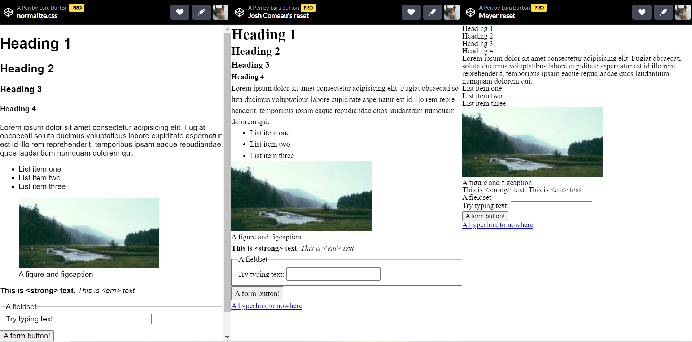
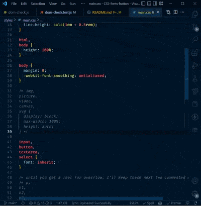
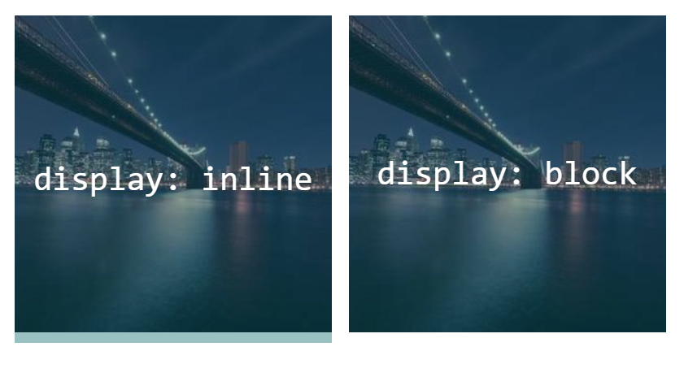

# CSS fonts and a button asdfjklas

**Objectives**: Learn how to use CSS stylesheets. Understand what  user-agent stylesheets are and the purpose of CSS resets. Add web fonts to your website. Create a button class to style links to appear as "web buttons." Adjust whitespace to keep your pages from looking crowded.

**Concepts covered**: CSS resets, box-model, CSS variables, `:hover` pseudoclass, simple transitions.

| :warning: This assignment builds on your _Responsive images and SVG images_ assignment                                                                                                                                                                                                                                                                                                                                                                                                                                                                                                                                                       |
| :------------------------------------------------------------------------------------------------------------------------------------------------------------------------------------------------------------------------------------------------------------------------------------------------------------------------------------------------------------------------------------------------------------------------------------------------------------------------------------------------------------------------------------------------------------------------------------------------------------------------------------------- |
| After cloning this repo and opening it in VSCode, copy the following files and folders from your _Responsive images and SVG images_ assignment into this repo.<br><br><ul><li>📄 index.html</li><li>📄 favicon.ico</li><li>📁styles</li><li>📁images</li><li>📁about</li><li>📁contact</li></ul><br>**Make sure that you don't copy any other folders or files, including the `test` folder, the hidden `.git` and `.github` folders, and the `package.json` files**<br><br>You can remove the inline SVG from your main `index.html` if it doesn't fit with your design. <br><br>You can also remove `<figure>` and `<figcaption>` from your image if you'd prefer. |

## CSS reset stylesheets

Browsers have  _user-agent stylesheets_ that provide default styling for HTML elements. Since each vendors' user-agent stylesheet styles the HTML differently, most developers use a CSS reset stylesheet to make sure their websites look consistent across all browsers. Most CSS frameworks also use a reset. Bootstrap, for example, uses [Reboot](https://getbootstrap.com/docs/4.0/content/reboot/) which is based on normalize.css. Some popular CSS resets include the following:

- [normalize.css](https://necolas.github.io/normalize.css/) - a popular CSS reset that keeps some default styles. I recommend this for beginners.
- [Josh Comeau's simple reset](https://www.joshwcomeau.com/css/custom-css-reset/) - a minimalistic modern alternative to normalize.css that keeps many default styles but is notably different from normalize as it removes all margins, adds line spacing, and doesn't set a default font.
- [Eric Meyer's Reset](https://meyerweb.com/eric/tools/css/reset/) - one of the original CSS resets. It removes all default styles. This requires you to add styles for all elements.

[View a CodePen comparing these three CSS resets 
](https://codepen.io/lsburton/live/yLqwyOd)

This semester, I included Josh Comeau's simple reset in the `styles/main.css` file. You should have added this file to all your HTML files in the previous assignment. I did comment out some of the resets that I didn't want to use until you understood the concepts, so you'll need to uncomment them.

Let's uncomment some resets for this assignment. Open `styles/main.css`. On line 16, remove the comment marks `/*  */` around  `margin: 0;` so it looks like this:

```css
* {
  margin: 0;
  /* this an experimental line-height; if it breaks, add line-height: 1.5 to body */
  line-height: calc(1em + 0.5rem);
}
```

Next, go to line 31 and uncomment this block:

```css
img,
picture,
video,
canvas,
svg {
  display: block;
  max-width: 100%;
  height: auto;
}
```

| 💡 Shortcut to quickly comment and uncomment blocks of code in VSCode |
|:-----|
|1. Select the lines you want to comment or uncomment<br>2. Press `Ctrl` + `/` (Windows) or `⌘` + `/` (Mac)<br><br> |

### An aside on images and `display: block`

One of the more "annoying" CSS quirks for beginnners is that, by default, images are inline elements. This made sense when the web was first created and its focus was on text, but now that we frequently use standalone images, it can cause some problems, especially when adding overlays (because an inline element has line height, overlays over images will have a gap at the bottom because of `line-height`). If the image is set to `display: block` it loses the `line-height` and the overlay will be flush with the bottom of the image. In the image below, the overlay is a transparent blue-green color.



_[Link to the CodePen](https://codepen.io/lsburton/pen/eYjXmqg?editors=1100) that generated this image._

 The `max-width: 100%` property keeps large images from overflowing thier containers, but you may need to override it on occasion; however, that's for a later lesson. I added the `height: auto` property to make sure images keep their aspect ratio and don't appear squashed.

## CSS variables and the `:root` selector

Since colors are used in many places, it's a good idea to define them as variables. This way, if you decide to change your color scheme, you only need to change the variable values.

Variables that are used throughout your website are best added to the `:root` selector. This is a special selector that represents the root element of the document. It's almost the same as the `html` selector, but, because it is a pseudo-class, it has a higher specificity.

At the top of your `styles/main.css` file, add your style guide colors as CSS variables. You can name the variable using its color or its purpose, e.g. `--dark-blue` or `--primary-heading-color`

Developers do both and argue over which is best.
| 📖 Naming color variables |
| :----------------------------------------------------------------------------------------------------------------------------------------------------------- |
| Review CSS Trick's [What do you name color variables?](https://css-tricks.com/what-do-you-name-color-variables/) for naming ideas |

Here are two samples of how you might define your colors:

```css
:root {
  --dark-blue: #0a192f;
  --light-blue: #c7d2fe;
  --lightest-blue: #e2e2e2;
  --off-white: #e6f1ff;
  --text-color: #333;
}
```

or

```css
:root {
  --color-main: #0a192f;
  --color-highlight: #c7d2fe;
  --color-highlight-light: #e2e2e2;
  --color-text: #333;
  --color-off-white: #e6f1ff;
}
```

I personally prefer the second style. I also tend to prefix the variable "type" to the variable name to help organize long lists of variables.

Variables aren't limited to colors and can be used for other values, such as font sizes, spacing, and box shadows &ndash; basically anything that you might want to reuse.

### An aside: `html` vs `:root` vs `*`

`<html>` and `:root` refer to the same element, but since `:root` is a pseudo-class, it has a higher specificity than the `html` selector, so it will always override it.

The universal selector `*` is a little different. It applies properties to every element. `<html>` and `:root` only pass down inheritable properties. For example, `background-color` is an inheritable property. If set in `:root` like this:

```css
:root {
  background-color: papayawhip;
}
```

It will appear to be the same as

```css
* {
  background-color: papayawhip;
}
```

because the `background-color` will be inherited by all elements. However, if you set a property that is not inheritable, such as `border`, it will not be inherited. So

```css
:root {
  border: 6px solid rebeccapurple;
}
```

and

```css
* {
  border: 6px solid rebeccapurple;
}
```

will behave differently. The `border` will only be applied to the `:root` element in the first example, but will be applied to every element in the second example. Try it out in a CodePen!

| :bulb: Cascade, specificity, and inheritance |
:-----|
| To learn more see MDN's [Cascade, specificity, and inheritance](https://developer.mozilla.org/en-US/docs/Learn/CSS/Building_blocks/Cascade_and_inheritance) or, while it's an older article, it's still quite helpful, Sitepoint's [CSS Inheritance: An Introduction](https://www.sitepoint.com/css-inheritance-introduction/). |

## Adding fonts

We'll use [Google fonts](https://fonts.google.com/) in this course because they are free and they are easy to use. For detailed info and a video tutorial on adding Google fonts, see [Using web fonts from a font delivery service](https://fonts.google.com/knowledge/using_type/using_web_fonts_from_a_font_delivery_service).

- Add the two Google fonts from your style guide to your website. Make sure to add both fonts at once. Add the `<link>` elements to the `<head>` of each of your HTML documents. The fonts should be loaded  before your `styles/main.css` file.
- Use the `font-family` property to set the font for your headings and body text.
- Assign colors to your headings and body text using the `color` property and your CSS variables.

  ```css
  color: var(--dark-blue);
  ```

Optional

- Use the `font-weight` property to set the weight of your headings and body text.
- Use the `font-size` property to set the size of your headings and body text.
- Use the `letter-spacing` property to set the letter spacing of your headings.

## Styling general links

The default styling for `<a>` elements includes an underline. Most websites don't use underlines for links; rather, they make the links a different color than the base text. Remove the underline by overriding the default styling using the `a` selector. Give links a color using the `color` property and your CSS variables.

Also add a `:hover` pseudo-class to style links when the user hovers over them.

| :warning: "Dead" links and hover states                                                                                                                                                      |
| :------------------------------------------------------------------------------------------------------------------------------------------------------------------------------------------- |
| You don't want dead links (links without an `href` attribute) to look like active links by having a hover state. Write a `:hover` selector that targets only links with an `href` attribute. |

## A web button class

Many links on the web are styled as buttons. Buttons are a common way to signal users that an item is clickable.

- Add a link (`<a>`) below the text inside each of your two `<article>`s. Use a common link name such as "Learn More" or "Contact" or "Buy Now", etc. The link can be dead (no `href` attribute).
- Add `class="button"` to the `<a>`
- Create a `.button` class in your CSS file to style the link as a modern, stylish "web button." Use your color variables.
- Override the default `a` color if needed.
- Add a `:hover` effect for your button. Make sure you override an existing `a:hover` effects.
- Add a transition to smooth the change when the button is hovered over. Below is a simple transition that you can use:

  ```css
  transition: background-color 300ms ease;
  ```

- Change the cursor to a pointer when it's on top of/in the web button.

## Whitespace

| :movie_camera: Watch a video on whitespace                                                                                                                   |
| :----------------------------------------------------------------------------------------------------------------------------------------------------------- |
| For tips on whitespace, watch [Kevin Powell's Web design tips for developers](https://www.youtube.com/watch?v=ykn4XNDwW7Q). Although, I prefer `em` to `ch`. |

- Increase the default line height of your body text using the `line-height` property.
- Set a line-height for your headers (h1, h2, h3), remembering that larger font sizes need smaller line heights
- Center, pad, and limit the max-width of your `<main>` element using the following CSS:

```css
main {
  margin: 0 auto;
  padding: 0 1rem;
  max-width: 50rem;
}
```

- Add padding - usually 1rem is good - to the right and left of any text not inside `<main>` so that it doesn't run to the edge of the viewport. Add the padding to the highest level element possible.
- You can adjust the `max-width` and `padding` as needed to fit your style.
- If needed, limit the length of any line of text outside of `<main>` to 40-70 characters (try using em unit).

| :book: Read about collapsing margins                                                                                                                                                             |
| :----------------------------------------------------------------------------------------------------------------------------------------------------------------------------------------------- |
| Collapsing margins can be tricky and sometimes confusing. Review Smashing Magazine's section on [margin collapsing](https://www.smashingmagazine.com/2019/07/margins-in-css/#margin-collapsing). |

- Adjust the top and bottom margins of your headings and main elements (aside, footer, etc.) to keep your page from looking cramped. Make sure you are aware of any collapsing margins.

## :rocket: Publish on Github Pages

When your assignment is finished, sync it to Github and publish it on Github Pages. Remember to paste the Github pages URL in the repo _About_ section.

Make sure to test your website on [validator.nu](https://validator.nu/). If you have any errors, fix them before submitting your URL to Learning Suite.

### :star: Assignment tests

_general HTML structure_

- `<head>` should have a `<title>`
- `<head>` should have a `<meta>` description element
- all HTML files should contain an `<h1>`, and only one `<h1>`
- all HTML files should contain favicon information
- all index.html files must contain a `<header>`
- all `<header>` elements must contain a `<nav>` element
- menu items in header `<nav>` must be in an `<ul>`

_tests for main index.html_

- main index.html must contain a `<main>`
- `<main>` must contain two `<article>` elements
- each `<article>` must contain an `<h2>` and at least one `<p>`
- main index.html must contain an `<aside>`
- main index.html must contain a `<footer>`
- text in the `<aside>` must inside a `<p>`
- text in the `<footer>` must be inside a `<p>`

_image tests_

- image paths are all lowercase and contain no spaces
- images must be 1920px wide or less
- relative paths to images used, and images must be in the images directory
- images that aren't SVGs and images outside `<picture>` elements have the `` height and width attributes set to the src image's intrinsic dimensions
- main index.html contains a `<picture>` element
- `<picture>` element must contain three `<source>` elements with media and srcset attributes
- `<picture>` element must contain a fallback image
- about page includes an `` element that uses srcset and sizes to load three versions of the same image with different widths
- contact page loads an SVG file with ``

_CSS tests_

- `normalize.css` loaded as first stylesheet on all pages
- stylesheet `main.css` in styles folder is loaded on all pages using relative links
- Google Fonts stylesheet is loaded on all pages after `normalize.css` but before `main.cs`s`
- global box-sizing rule set to `border-box`
- `:root` contains CSS variables for colors
- `font-family`, `color`, and `line-height` set in body
- remove underlines from `<a>`
- `:hover` class for all `<a>` that contain `href` (non-dead links)
- two web buttons on main page: `<a class="button">`
- CSS contains `.button` style declaration
- CSS contains `.button:hover` style declaration

_When you are ready for you assignment to be graded, submit a link to your Github repo on Learning Suite for the **CSS Fonts and a Button** assignment_
